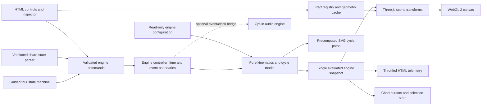

# Architecture and implementation contracts

## 1. System shape

Build a single static React/TypeScript/Vite application. Use Three.js through React Three Fiber for scene composition, with selective Drei helpers. Keep simulation math in pure TypeScript and ordinary controls in semantic HTML. SVG is sufficient for the small deterministic charts. A small Zustand UI store is the default; do not introduce a second simulation state store.

There is no backend, database, authentication service, API key, AI model invocation, worker farm, or cloud infrastructure. Resolve compatible stable dependency versions from official documentation in M01, pin them, and generate the lockfile with the package manager. The plan intentionally does not guess future package versions.



## 2. Repository layout

```text
src/
  app/                 App, error boundaries, feature composition
  engine/
    types.ts           Serializable configuration and snapshot contracts
    config.ts          The one specified V8 configuration
    math.ts            Units, positive modulo, validated helpers
    kinematics.ts      Crankpins, wrist pins, pistons, rod poses
    cycle.ts           Stroke labels, valve profiles, cam phases
    pressure.ts        Disclosed idealized pressure and volume
    events.ts          Boundary-crossing events, no render dependency
    EngineController.ts
  scene/
    EngineScene.tsx    Renderer, camera, lighting, scene composition
    EngineRig.tsx      Registry-to-snapshot transform application
    registry.ts       Stable part metadata and group relationships
    geometry/          Reusable procedural builders and cache
    parts/             Block, heads, pistons, rods, crank, valvetrain
    materials/         Shared physical materials and selected variants
    camera/            Presets, fitting, orbit limits
    section/           Section policy and clipped/static housing variants
    explode/           Assembly offsets and staged transitions
  features/
    controls/          Transport, RPM, playback, view, quality
    inspector/         Part tree, selected-part content, visibility
    timeline/          Cycle and firing-order strip
    charts/            Valve and pressure-volume SVG views
    tour/              Explicit step state machine
    share/             Validated URL state and PNG capture
    quality/           Tier selection and measured statistics
  state/uiStore.ts     User intent, layout, selection, preferences
  audio/               Optional P2 processor and clock bridge
  styles/              Tokens, layout, accessible component styling
public/                Original static assets only
 tests/
  unit/                Engine functions and validators
  integration/         Controller-to-view contracts
  e2e/                 Browser user journeys
  visual/              Fixed-environment screenshot baselines
  fixtures/            Known phases/configuration and deterministic seeds
```

The tree is an ownership guide, not a requirement to create empty files. Split modules when their responsibility exists. Keep App and EngineScene as composition roots, not thousand-line implementation files.

## 3. Data contracts

Use explicit names and units. Suggested interfaces:

```ts
type CylinderId = 1 | 2 | 3 | 4 | 5 | 6 | 7 | 8;
type BankId = 'A' | 'B';
type Stroke = 'power' | 'exhaust' | 'intake' | 'compression';
type Vec3 = readonly [number, number, number];

interface CylinderDefinition {
  readonly id: CylinderId;
  readonly bank: BankId;
  readonly bankAngleRad: number;
  readonly journalIndex: 0 | 1 | 2 | 3;
  readonly axialOffsetM: number;
  readonly firingAngleDeg: number;
}
interface EngineConfig {
  readonly boreM: number;
  readonly crankRadiusM: number;
  readonly rodLengthM: number;
  readonly compressionRatio: number;
  readonly journalAnglesAtZeroRad: readonly number[];
  readonly journalZM: readonly number[];
  readonly cylinders: readonly CylinderDefinition[];
}
interface CylinderSnapshot {
  readonly id: CylinderId;
  readonly cycleAngleDeg: number;
  readonly stroke: Stroke;
  readonly crankPinM: Vec3;
  readonly wristPinM: Vec3;
  readonly pistonTravelM: number;
  readonly intakeLiftM: number;
  readonly exhaustLiftM: number;
  readonly volumeM3: number;
  readonly idealPressurePa: number;
}
interface EngineSnapshot {
  readonly crankAngleDeg: number; // normalized [0,720)
  readonly nominalRpm: number;
  readonly playbackScale: number;
  readonly cylinders: readonly CylinderSnapshot[];
}
```

Add tested validation before accepting configuration or URL values. Readonly contracts define consumer semantics; the hot path may evaluate into a preallocated internal buffer. Do not expose that mutable buffer as a stable immutable React-store object. Provide a pure allocating evaluator for unit tests and an equivalent allocation-conscious render evaluator only when needed; assert both agree.

The public command union should cover play, pause, set RPM, set playback scale, seek, step, next firing event, reset all, and suspend/resume visibility. UI commands validate inputs before mutating controller state. Camera, selection, visibility, tour state, and quality are UI intent, not inputs to the piston equations.

## 4. State ownership and timing

EngineController owns phase, cycle count, transport, speed, elapsed-time policy, and event sequence. React state owns user intent, open drawers, selected part, camera preset, and safe persisted preferences. The scene reads one evaluated snapshot for a render update. HTML telemetry samples that snapshot at no more than 10 Hz while moving and updates immediately when paused/seeking.

Do not call React setState for every piston on every frame. Update mesh transforms through refs and reuse scratch vectors, matrices, and quaternions. The R3F [performance guidance](https://r3f.docs.pmnd.rs/advanced/pitfalls) specifically addresses avoiding hot-loop React state updates and reusing expensive objects.

Ordinary raf/useFrame delta drives the analytic controller; the event layer handles all boundaries crossed in a tick. No cylinder owns its own timer. Tab visibility and anomalous delay policy are explicit. A seek is a state transaction: pause, set phase, clear events, evaluate snapshot, refresh scene and charts, then notify sampled UI.

## 5. Geometry, hierarchy, and materials

Create shared geometry at initialization, from config dimensions. Use lathe/extrusion/tube/cylinder composition where appropriate, and merge static compatible detail only when it preserves selection and quality. Reuse bolts/rings/springs via shared geometry or instancing. Map an instanceId to a stable part/group ID where instances are selectable.

Each registry entry contains partId, display name, kind, parent/group IDs, associated cylinder if any, authored local transform, procedural builder key, material key, visibility/section policy, description, and exploded offset. Stable IDs must not depend on array iteration order or translated display names.

The operating rig uses geometric parentage that preserves shared crank motion. Moving rods must not inherit crank rotation twice. Distinguish fixed bank transforms, crank motion, rod endpoint poses, and piston translations. Unit-test parent/local/world transform composition with known points.

Explosion is a display transformation applied to coherent part groups after freezing the operating pose. Retain original local transforms rather than accumulating offsets every frame. Staging can separate covers/heads first, then piston/rod groups, then crank/cam. At amount zero, the matrix state must return to assembled values within a specified tolerance. Do not continue to claim connected operating geometry while parts are separated.

Use physically legible materials: distinguish cast housing, machined steel, lighter aluminum, dark seals, and subtle copper/brass details where appropriate. Avoid mirror-like metal everywhere. Selection should use a clear outline or controlled material variation without permanently mutating a shared material used by unrelated parts.

## 6. Section and visibility strategy

Default to a small set of engineered inspection modes, not an arbitrary CAD slicing tool. Use a prebuilt open/half housing where possible; use tested local material clipping for appropriate housing pieces. The WebGLRenderer baseline supports local clipping. Do not use WebGPU-only ClippingGroup as if it worked with this renderer. Consult the official [WebGLRenderer](https://threejs.org/docs/pages/WebGLRenderer.html) documentation.

Clipping does not automatically produce capped solid surfaces; do not promise a capped section unless implemented. Static housing section variants can provide intentional rim/cap geometry. Leave moving parts visible unless the selected section explicitly cuts them. Hidden/clipped parts must not intercept canvas selection when they are not meant to be selectable.

Document whether the exposed view is a removed housing, a mathematical section, or transparency. Do not call all three an x-ray. Avoid many overlapping transparent surfaces; use transparency selectively and test depth ordering from all camera presets.

## 7. Charts and explanatory content

Precompute deterministic cycle samples when configuration changes, not on every frame. SVG paths display the full cycle; a cursor/marker follows the current selected-cylinder phase. Provide stroke text and numeric units in HTML. Use the same pure volume/pressure/valve functions as the scene snapshot. Do not maintain a separate chart-only model with different phase offsets.

The pressure path includes explicit duplicate-volume pre/post points at idealized jumps. Tooltips describe assumptions. A compact table or text summary remains usable without interpreting the graphic. Avoid an aria-live region announcing rapidly changing RPM/pressure on every sample.

## 8. Camera, input, and guided tour

Camera presets include position, target, framing padding, and safe min/max distances. Fit actual engine bounds, including exploded bounds and visible UI panel insets. Clamp orbit/zoom to avoid unintentionally entering opaque housing. Moving a camera preset respects reduced motion and cancels cleanly when the user takes control.

Separate an intentional click/tap from an orbit drag using a small movement threshold. UI overlays should not send pointer events into the canvas. The HTML parts tree offers equivalent selection to raycasting.

The tour is a finite state machine with six named steps, entry commands, explanatory text, and an exit policy. Save the user's pre-tour state, restore it on Cancel, and clean up listeners/transitions. Do not implement a tour as unrelated setTimeout chains.

## 9. Share state and capture

Use a versioned schema with an allowlist. Bound URL length and numeric ranges; reject NaN/Infinity, unknown part IDs, invalid enums, and unsupported versions. Encode camera presets rather than unbounded arbitrary object graphs. Open shared links paused and muted. Do not persist an enabled audio state that auto-starts sound on a later visit.

PNG capture uses a controlled render/canvas path, same-origin assets, and a bounded resolution. Restore renderer state after capture and revoke object URLs. Do not turn on preserveDrawingBuffer permanently merely to simplify export. Distinguish engine-view export from full-page screenshots.

## 10. Optional sound boundary

P2 sound is an independent feature module. Create/resume AudioContext only after an explicit user action and handle browser denial. Use an AudioWorklet or an equivalently tested audio-clock scheduling strategy, not main-thread per-frame sample triggering. For a four-stroke V8 there are four firing events per crank revolution, so average event frequency at nominal RPM is RPM/15 Hz. Bank pulses still follow the chosen firing sequence.

V1 sound, if built, operates only in real-time playback. Slow motion, pause, seek, explosion, and hidden tabs mute it and reset scheduling; the UI explains this. Crossfade starts/stops conservatively. It is simplified synthesized sound, not validated exhaust acoustics. Never let unavailable sound prevent visual operation. See `SOURCES.md` A01–A03.

## 11. Quality tiers and resources

High may enable better shadows, denser geometry, and an optional subtle postprocessing pass. Balanced should be the normal laptop tier; low should preserve the complete mechanism while reducing tessellation, detail, shadows, and pixel ratio. Automatic tier changes must not alter phase, cylinder count, or event timing.

Geometry/material caches have explicit lifetimes. Dispose resources on rebuild/unmount, remove listeners, cancel raf/tour callbacks, and disconnect audio. Repeated view/quality changes must not grow GPU resources indefinitely. Treat renderer statistics as measured counters with documented capture method, including extra passes.

## 12. Testing and deployment

M01 establishes actual scripts for `pnpm dev`, `lint`, `typecheck`, `test`, `test:e2e`, `build`, and `preview`, plus any visual/performance scripts used. CI installs from the lockfile and runs lint, typecheck, unit/integration tests, build, and repeatable browser smoke tests. Pin a consistent browser environment for visual baselines. Hardware performance is a separate recorded gate, not a claimed consequence of passing unit tests.

Use relative/base-aware asset paths. Prepare GitHub Pages deployment for the repository path `/v8-engine/` following [Vite's static deployment guide](https://vite.dev/guide/static-deploy). Test that path locally before any publication. A deployment workflow is not evidence of a deployed site. Record owner authorization, workflow result, actual URL, and a post-deploy browser smoke test before claiming a live demo.
